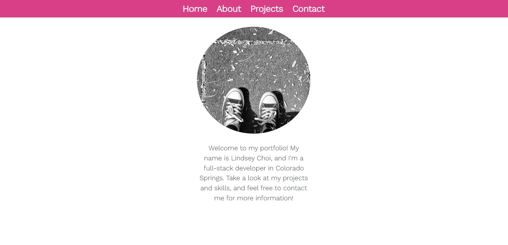
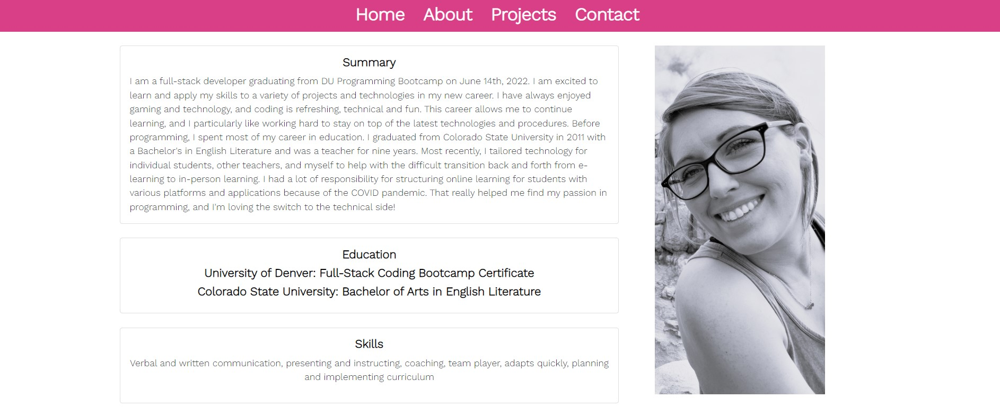
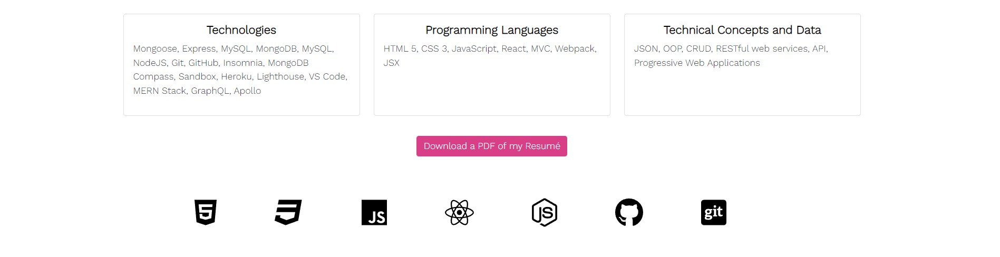
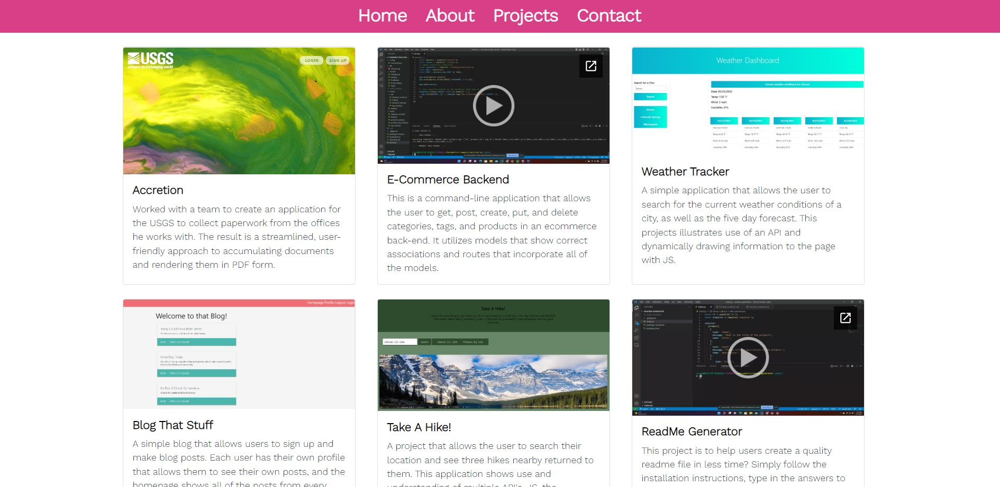
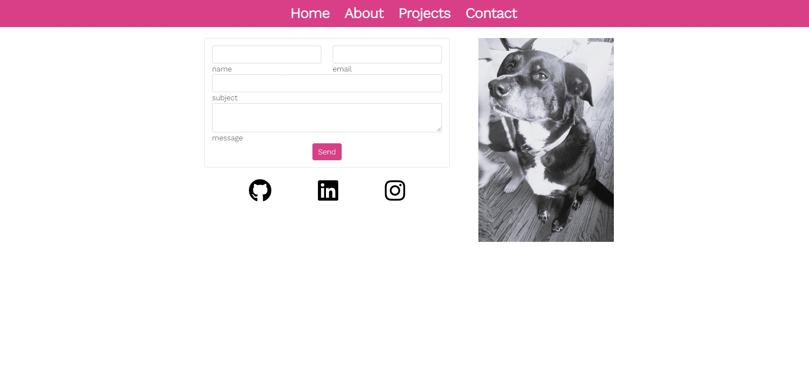

# lindseychoi-portfolio

## Summary
This application is a professional portfolio built using React that includes a navigation bar, four different components (home, about, projects, contact me),links to projects I have worked on and their repos on GitHub, my resume, and information on how to contact me. On the projects page, each title links to the repo of the project on GitHub and the picture links to the deployed site or to a video of a backend project (if there is not deployed front end). The portfolio is built responsively and scales well for small screens.

GitHub Pages Link: https://lindseychoi.github.io/lindseychoi-portfolio/
GitHub Repository Link: https://github.com/lindseychoi/lindseychoi-portfolio

## Table of Contents

- [Screenshots](#screenshots)
- [Installation](#installation)
- [Usage](#usage)
- [Contact Me](#contact-me)

### Screenshots:

## Installation
* Clone the repository and npm i in your bash terminal.
* npm start
* It is also deployed on GitHub pages (visit the link above in the description).

## Usage
The purpose of this application is to show potential employers and current team my skills and experiences and what I bring to the table.

## Contact Me

**Lindsey Choi** 

    email: lindsey.e.choi@gmail.com
        
    github: https://github.com/lindseychoi

